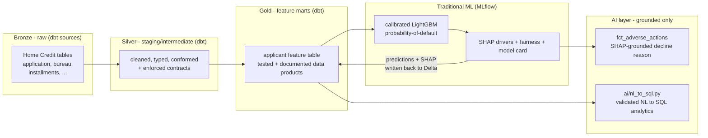

# Credit Decisioning Lakehouse

[](https://github.com/ghoshp83/credit-decisioning-lakehouse/actions/workflows/ci.yml)
[](https://ghoshp83.github.io/credit-decisioning-lakehouse/)

📖 **[Live dbt docs & lineage](https://ghoshp83.github.io/credit-decisioning-lakehouse/)** — browse every model with its tests and documentation, and the full lineage DAG from raw sources to the gold marts.

**An auditable credit-risk pipeline on dbt + Databricks: raw applications become governed feature marts, a calibrated model predicts probability-of-default, and every decline is explained in plain language — grounded in the model's own SHAP drivers, traceable from raw row to final reason.**

Built for risk and data teams who need a credit model that is not only accurate
but *defensible*: each prediction comes with a regulator-style adverse-action
reason, each feature is a tested, documented data product, and the whole path
from raw data to decision is lineage-tracked.

## Why this exists

Most credit-scoring demos stop at an AUC number in a notebook. Real lending
needs three things that notebook scoring never delivers: **governed features**
(versioned, tested, documented — not ad-hoc columns), **calibrated and
explainable predictions**, and **traceability** from a raw record to the reason
an applicant was declined. This project treats all three as first-class.

The design principle is deliberate: **traditional ML owns the prediction; the
LLM only explains and answers questions about it.** A gradient-boosted model
predicts default risk (where it beats an LLM on accuracy, cost, and latency); an
LLM turns that model's SHAP drivers into a plain-language reason and answers
natural-language questions over the portfolio. The LLM is never in the
prediction path.

## Architecture



Predictions and SHAP values are written **back to Delta as a dbt source**, so the
model's outputs re-enter the governed, lineage-tracked layer instead of escaping
into a notebook.

## Tech stack — and why

| Layer | Choice | Why |
|------|--------|-----|
| Transformation | **dbt Core** + `dbt-databricks` | Features as tested, documented, version-controlled data products with built-in lineage — the governance notebooks lack. |
| Lakehouse | **Databricks + Delta Lake** | ACID + `MERGE` give idempotent, reproducible feature builds; liquid clustering on the marts matches their real access patterns; time-travel lets an audit replay the exact table version a decision ran against (see [Runbook](RUNBOOK.md)). |
| Prediction | **LightGBM + MLflow + SHAP** | Gradient boosting is the honest state-of-the-art for tabular credit risk; MLflow makes runs reproducible; SHAP makes each decision explainable. |
| AI layer | **Databricks `ai_query`, grounded only** | A built-in foundation model, called from dbt SQL — turns SHAP drivers into compliant plain-language reasons and answers NL questions. Stays inside the lakehouse (no external API, no secret); measured, never predicting. |
| CI | **GitHub Actions** | Lint + `dbt parse`/`build` on every push keeps the project shippable. |

## Run it

> Requires a Databricks workspace (SQL warehouse) and the Home Credit Default
> Risk dataset loaded into a raw schema.

```bash
# 1. Install the dbt tooling (uv, as with the ML/AI envs further below)
uv venv --python 3.11 .venv
uv pip install --python .venv -r requirements-dev.txt

# 2. Point dbt at your Databricks workspace (no secrets in files)
#    See .env.example for every variable and its default.
export DATABRICKS_HOST=dbc-xxxx.cloud.databricks.com
export DATABRICKS_HTTP_PATH=/sql/1.0/warehouses/xxxx
export DATABRICKS_TOKEN=dapi...
cp profiles.yml.example ~/.dbt/profiles.yml

# 3. Build and test the dbt project
.venv/bin/dbt deps
.venv/bin/dbt build          # runs models + their tests
.venv/bin/dbt docs generate  # lineage / documentation
```

### Train the probability-of-default model

The model trains on the governed gold mart (`fct_applications`) — the single
source of truth for features, so there is one definition of every feature and
lineage holds from raw row to model input.

```bash
# Separate env for the ML stack, kept off the dbt adapter's dependency pins
uv venv --python 3.11 .venv-ml
uv pip install --python .venv-ml -r requirements-ml.txt

# Export one snapshot of the gold feature mart to a local training boundary
DATABRICKS_HOST=... DATABRICKS_HTTP_PATH=... DATABRICKS_TOKEN=... \
  .venv-ml/bin/python ml/pull_features.py

# Train the LightGBM PD model; runs are tracked in a local MLflow store (mlruns/)
.venv-ml/bin/python -m ml.train

# Calibrate probabilities + fairness slices; writes metrics behind the model card
.venv-ml/bin/python -m ml.calibrate

# Score all applicants + write predictions and top SHAP drivers back to Delta
DATABRICKS_HOST=... DATABRICKS_HTTP_PATH=... DATABRICKS_TOKEN=... \
  .venv-ml/bin/python -m ml.shap_drivers
```

See the [Model Card](MODEL_CARD.md) for metrics, calibration, fairness slices,
and limitations.

### Explain and query the portfolio — the grounded AI layer

The AI layer runs **inside Databricks** via `ai_query` against a built-in
foundation model: no external API, no secret. Adverse-action explanations are
dbt models (perfect lineage); the NL→SQL helper is a small validated Python
client.

```bash
# 1. Adverse-action reasons: one grounded, plain-language decline reason per
#    declined applicant. The LLM may cite only that applicant's real SHAP
#    drivers (the prompt is built deterministically upstream in SQL).
dbt build --select int_adverse_action_drivers fct_adverse_actions

# 2. Grounding gate: fails if any reason cites a factor the model did not use.
dbt test --select assert_adverse_action_reasons_grounded

# 3. Ask the portfolio a question in English. The model only *drafts* SQL;
#    it is validated read-only + allowlisted + EXPLAIN-checked before running.
uv venv --python 3.11 .venv-ai
uv pip install --python .venv-ai -r requirements-ai.txt
DATABRICKS_HOST=... DATABRICKS_HTTP_PATH=... DATABRICKS_TOKEN=... \
  .venv-ai/bin/python -m ai.nl_to_sql "How many scored applications have a PD above 0.3?"

# 4. Score the NL→SQL helper against the gold-question set.
.venv-ai/bin/python -m ai.eval_nl_to_sql
```

## Operational characteristics

- **Idempotent builds** — re-running `dbt build` reproduces the same marts.
- **Data quality as code** — schema/`not_null`/accepted-values tests and dbt
  unit tests gate every model.
- **Observability** — dbt artifacts (`run_results.json`, lineage) plus MLflow
  run tracking; prediction-distribution tests catch drift.
- **Auditability** — every decision traces raw → feature → prediction → reason.
- **Grounded AI, measured** — a dbt test fails the build if any adverse-action
  reason cites a factor the model did not use; across 500 generated reasons,
  100% cite a real driver and 0 cite a foreign one. The NL→SQL helper scores
  6/6 on its gold-question set and refuses any non-read-only or off-allowlist
  query.
- **Failure handling** — see the [Runbook](RUNBOOK.md) for what to do when a run
  fails, a test fails, a source looks stale, or a contract is violated.

## Honest disclaimer

All three layers run end-to-end against a live Databricks workspace. The **dbt
transformation layer** has staging models, an applicant feature mart with an
**enforced contract**, and an **incremental installment-payments fact** (Delta
`MERGE`, idempotent re-runs), all tested, plus CI and docs. The **ML layer**
trains a **LightGBM PD model with MLflow tracking** (AUC ≈ 0.68, KS ≈ 0.26 on a
held-out split), **calibration measured** with a [model card](MODEL_CARD.md)
(the raw probabilities are already well-calibrated — Brier ≈ 0.071 — and
reported as such), and writes **per-applicant SHAP drivers back to Delta**,
re-entering dbt as a governed source and the `fct_scored_applications` mart —
lineage closed from raw row to prediction. The **grounded AI layer** then turns
each declined applicant's SHAP drivers into a compliant plain-language reason
via `ai_query` (`fct_adverse_actions`), gated by a grounding test, and answers
plain-English portfolio questions through a validated NL→SQL helper.

Other honest notes:
- The **adverse-action LLM stays inside the lakehouse** (`ai_query` against a
  built-in Databricks foundation model on the free tier). Reasons are generated
  for a **bounded sample of the highest-risk declines** (`decline_threshold` +
  `adverse_action_sample_size` in `dbt_project.yml`, defaulting to the top 500)
  because `ai_query` is metered — the flow scales to the full declined
  population by raising the cap. Adverse-action wording is **illustrative, not
  legal advice**.
- The **NL→SQL helper guarantees safety, not semantic correctness.** Its gates
  (single read-only statement, table allowlist, server-side `EXPLAIN`) block
  unsafe or off-schema SQL, but a vaguely-worded question can still yield a
  valid query that answers the wrong thing. It scores 6/6 on the curated
  gold-question set; treat it as an analyst aid, not an unattended oracle.
- The dataset is **Home Credit Default Risk** — a *static historical* dataset,
  not live loan origination.
- **Source freshness checks are intentionally disabled** (`freshness: null` in
  `_sources.yml`): a one-time static dump has no ingestion clock or load
  timestamp, so a freshness threshold would never meaningfully fire. The hook to
  re-enable it (a `loaded_at_field` + threshold) is documented in-line for the
  day a live feed is attached.
- The incremental fact's high-watermark filter is **illustrative of the
  mechanics** on this static dump (there is no live ingestion). Idempotency is
  guaranteed by the Delta `MERGE` on a verified-unique surrogate key — proven by
  re-running the model and observing identical row counts, not by the watermark.
- The PD model trains on a **deliberately compact feature set** (the governed
  mart's ~13 columns) to keep the lineage story legible; published Home Credit
  leaderboards reach higher AUC with hundreds of engineered features. The point
  here is the *governed, explainable, traceable* pipeline, not a leaderboard score.
- Fairness analysis uses the **proxy attributes available in the data**; it is
  not a substitute for a regulated fairness audit.
- The in-lakehouse LLM uses **`ai_query` foundation-model endpoints, which the
  free tier exposes** (verified). Custom **model serving** can be paid-tier, so
  the PD model trains and scores via local MLflow rather than a served endpoint
  — labelled as such.

## License

MIT — see [LICENSE](LICENSE).
