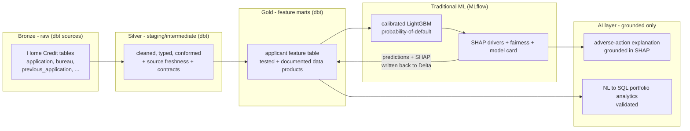

# Credit Decisioning Lakehouse

**An auditable credit-risk pipeline on dbt + Databricks: raw applications become governed feature marts, a calibrated model predicts probability-of-default, and every decline is explained in plain language — grounded in the model's own SHAP drivers, traceable from raw row to final reason.**

Built for risk and data teams who need a credit model that is not only accurate
but *defensible*: each prediction comes with a regulator-style adverse-action
reason, each feature is a tested, documented data product, and the whole path
from raw data to decision is lineage-tracked.

## Why this exists

Most credit-scoring demos stop at an AUC number in a notebook. Real lending
needs three things that notebook scoring never delivers: **governed features**
(versioned, tested, documented — not ad-hoc columns), **calibrated and
explainable predictions**, and **traceability** from a raw record to the reason
an applicant was declined. This project treats all three as first-class.

The design principle is deliberate: **traditional ML owns the prediction; the
LLM only explains and answers questions about it.** A gradient-boosted model
predicts default risk (where it beats an LLM on accuracy, cost, and latency); an
LLM turns that model's SHAP drivers into a plain-language reason and answers
natural-language questions over the portfolio. The LLM is never in the
prediction path.

## Architecture



Predictions and SHAP values are written **back to Delta as a dbt source**, so the
model's outputs re-enter the governed, lineage-tracked layer instead of escaping
into a notebook.

## Tech stack — and why

| Layer | Choice | Why |
|------|--------|-----|
| Transformation | **dbt Core** + `dbt-databricks` | Features as tested, documented, version-controlled data products with built-in lineage — the governance notebooks lack. |
| Lakehouse | **Databricks + Delta Lake** | ACID, time-travel, and `MERGE` give reproducible, idempotent feature builds and an auditable history. |
| Prediction | **LightGBM + MLflow + SHAP** | Gradient boosting is the honest state-of-the-art for tabular credit risk; MLflow makes runs reproducible; SHAP makes each decision explainable. |
| AI layer | **LLM, grounded only** | Turns SHAP drivers into compliant plain-language reasons and answers NL questions — measurable and grounded, never predicting. |
| CI | **GitHub Actions** | Lint + `dbt parse`/`build` on every push keeps the project shippable. |

## Run it

> Requires a Databricks workspace (SQL warehouse) and the Home Credit Default
> Risk dataset loaded into a raw schema.

```bash
# 1. Install tooling
python -m pip install -r requirements-dev.txt

# 2. Point dbt at your Databricks workspace (no secrets in files)
export DATABRICKS_HOST=adb-xxxx.cloud.databricks.com
export DATABRICKS_HTTP_PATH=/sql/1.0/warehouses/xxxx
export DATABRICKS_TOKEN=dapi...
cp profiles.yml.example ~/.dbt/profiles.yml

# 3. Build and test the dbt project
dbt deps
dbt build          # runs models + their tests
dbt docs generate  # lineage / documentation
```

## Operational characteristics

- **Idempotent builds** — re-running `dbt build` reproduces the same marts.
- **Data quality as code** — schema/`not_null`/accepted-values tests gate every
  model; source freshness flags stale inputs.
- **Observability** — dbt artifacts (`run_results.json`, lineage) plus MLflow
  run tracking; prediction-distribution tests catch drift.
- **Auditability** — every decision traces raw → feature → prediction → reason.

## Honest disclaimer

This repository is in **active development**. Current status: the project is
**scaffolded** — dbt project structure, staging model + tests, CI, and docs are
in place; the **feature marts, the ML model, and the AI layer are not yet
implemented**, and the pipeline has **not yet been run end-to-end** against a
live Databricks workspace.

When complete:
- The dataset is **Home Credit Default Risk** — a *static historical* dataset,
  not live loan origination.
- Fairness analysis uses the **proxy attributes available in the data**; it is
  not a substitute for a regulated fairness audit.
- Adverse-action wording is **illustrative**, not legal advice.
- Some Databricks features (model serving, AI Functions) may be **paid-tier
  only**; where the free tier lacks them, the equivalent runs locally or via an
  external API and is labelled as such.

## License

MIT — see [LICENSE](LICENSE).
